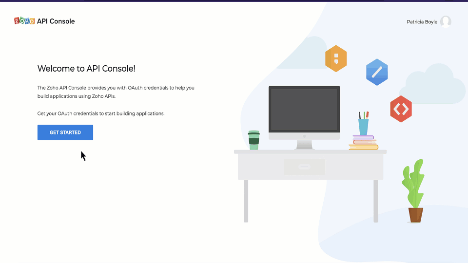

# ZOHO Integration
- The Node.js SDK for Zoho CRM allows developers to easily create Node.js applications that can be integrated with Zoho CRM. It serves as a wrapper for the Zoho CRM REST APIs, making it easier to access and utilize the services of Zoho CRM.

- Authentication to access the CRM APIs is facilitated through OAuth2.0, and the authentication process is streamlined through the use of the Node.js SDK. The grant and access/refresh tokens are generated and managed within the SDK code, eliminating the need for manual handling during data synchronization between Zoho CRM and the client application.

### Doc
- zoho nodejs : `https://www.zoho.com/crm/developer/docs/server-side-sdks/v1/node-js.html`
- medium : `https://medium.com/geekculture/using-zoho-api-for-leads-in-node-js-ea204e98d41b`

### Prerequisites
- Ensure that the client app has Node version 14.21.3 or above.
- An IDE such as Visual Studio Code or Eclipse
- Zoho CRM account.
- Basic knowledge of Node.js and RESTful APIs

### Setup
1. Create Node Environment
2. Install Server Framework : `npm install express`

### zoho crm integration

#### Step 1: Register your application
- Before you get started with authorization and make any API calls using the Zoho CRM Node.js SDKs, you need to register your application with Zoho CRM.
1. Go to Zoho [API console](https://accounts.zoho.com/signin?servicename=AaaServer&context=&serviceurl=https%3A%2F%2Fapi-console.zoho.com%2Flogin) and click on Add Client
2. Choose the client type as Self Client or Server-based Applications depending on your requirements. -> choose `Server-based Applications` 
3. Enter the required credentials.
4. Click CREATE
5. Make a note of the Client ID and Client Secret generated for your application.

#### step 2 : Install zoho crm
1. Install NodeJS SDK : `npm install @zohocrm/nodejs-sdk-7.0`
2. change package.json file to include make use of the ES modules : "type" : "module".

#### step 3 : Configuration and Initialization
- Before you get started with creating your NodeJS application, you need to register your client and authenticate the app with Zoho.

### Sample Code
- nodejs : [https://github.com/zoho/zohocrm-nodejs-sdk-7.0/blob/master/versions/2.0.0/README.md#sdk-sample-code]